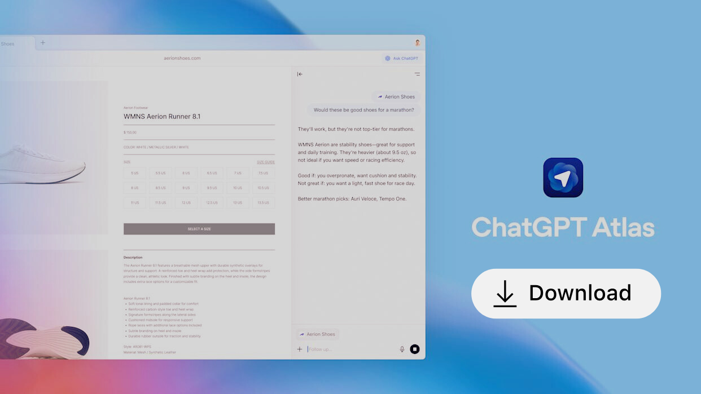

# 🌐 ChatGPT Atlas — Windows 版

**ChatGPT Atlas** 是一款智能网页浏览器，将 **ChatGPT 无缝集成到每一个网页中**，现已正式推出 **Windows 版本**。  
最初在 macOS 上发布的 Atlas，如今将同样先进的 **AI 驱动浏览体验** 带给 Windows 用户——结合上下文理解、记忆功能和自动化工作流，让你完全掌控浏览过程。

由 **Chromium 引擎** 驱动的 Atlas，确保顶级性能、全面兼容性，以及 ChatGPT 无与伦比的智能，为你带来更高效的网页体验。

  

---

## 🚀 概述

Atlas 完全改变了你探索互联网的方式。  
借助内置的 **ChatGPT 浏览器集成**，你可以直接在当前页面中提问、总结长篇内容、分析信息或执行自动化操作——无需离开当前标签页。

该 Windows 版本保留了 macOS 版本中备受喜爱的所有功能，包括 **Ask ChatGPT**、**Browser Memory（浏览器记忆）** 和创新的 **Agent Mode（智能代理模式）**，并经过重新优化，为 Windows 提供快速、流畅的体验。

---

## 🧠 智能代理模式（Agent Mode）

**Agent Mode（代理模式）** 允许 ChatGPT 在你的浏览器中直接执行实际操作任务：

- 自动进行网络研究  
- 填写表单并管理文档  
- 比较价格、产品和数据  
- 在你的指导下处理多步骤工作流  

你始终掌握控制权——操作可随时暂停、查看或停止。

> 🧪 *Agent Mode 当前为 Plus、Pro 和 Business 用户提供预览体验。*

---

## ⚙️ 引擎与兼容性

Windows 版 Atlas 基于 **Chromium 架构** 构建，融合了：
- **Blink** —— 与 Chrome 相同的渲染引擎  
- **V8** —— Google 高速 JavaScript 引擎  

这确保了对所有主要网页标准的全面兼容，同时引入以 **AI 为核心的设计**，注重清晰度、安全性与高效性。

---

## 🧩 主要功能

### 🆕 AI 驱动的新标签页
在 **Ask ChatGPT** 输入栏中输入问题或网址，即可立即获得 AI 增强的结果——将搜索与聊天合为一体。

### 🔎 增强搜索
可在 **网页结果**、**图片**、**视频** 与 **新闻** 视图之间切换，使搜索更高效、更精准。

### 💬 ChatGPT 侧边栏
可在任意网页中即时访问 ChatGPT，用于摘要、翻译或自动化操作——无需离开当前页面。

### ✍️ 内联 AI 编辑
选中输入框中的任意文本，点击 ChatGPT 图标，即可即时改进或重写内容——非常适合表单、邮件和在线文档。

### 🧠 浏览器记忆（Browser Memory）
启用 **Browser Memory** 让 ChatGPT 在多次会话间保留有用上下文，从而提供更个性化的回复。  
你可以：
- 查看与删除已存储页面  
- 排除特定网站  
- 启用“隐身模式”以实现无记忆的私密浏览  

### 🏠 智能主页推荐
Atlas 会从你的浏览习惯中学习，并智能推荐操作——例如恢复研究、回顾主题或自动执行常用任务。

### 🔐 隐私与数据控制
- 按页面或批量管理浏览历史  
- 使用 **无痕模式（Incognito Mode）** 进行私密浏览（禁用记忆与聊天）  
- 默认情况下，浏览数据 **不会用于模型训练**  
- 你可选择共享匿名化“网页数据”以获得更佳个性化体验  

### 👨‍👩‍👧 家庭与家长控制
所有 ChatGPT 家长设置会自动应用。  
你可以禁用 **Browser Memory** 或 **Agent Mode**，以确保多用户环境更安全。

---

## 💻 Windows 安装指南

> 🪟 ChatGPT Atlas 现已登陆 Windows 桌面！

### 🔽 安装步骤
1. 前往 [Releases](../../releases) 页面  
2. 下载 **AtlasSetup.exe** 安装包  
3. 运行安装程序并使用你的 **ChatGPT 账号** 登录  
4. 导入你的 **书签、密码与浏览历史**  
5. 将 **Atlas** 设置为默认浏览器  
6. 在设置中启用 **Ask ChatGPT** 与 **Browser Memory** 以获得完整功能  

---

## 🧭 平台支持

| 平台 | 可用性 |
|------|--------|
| macOS | ✅ 已发布 |
| **Windows** | 🆕 全新发布 |
| iOS | 🔜 即将推出 |
| Android | 🔜 即将推出 |

---

## 🧩 SEO 与关键词

**关键词：**  
ChatGPT Atlas, ChatGPT 浏览器 Windows, OpenAI Atlas 浏览器, AI 网络助手, ChatGPT 侧边栏, AI 驱动浏览器, 智能 Chromium 浏览器, ChatGPT 集成, ChatGPT Agent Mode, AI 自动化, 智能浏览, OpenAI 浏览器记忆, Windows AI 浏览器, OpenAI Atlas for Windows, ChatGPT Atlas Windows 下载, ChatGPT Atlas 下载, ChatGPT Atlas for Win, ChatGPT Atlas for Windows, ChatGPT Atlas Windows 版, ChatGPT Atlas Win 安装, ChatGPT Atlas 安装程序 Windows, ChatGPT Atlas Windows 版本, 下载 ChatGPT Atlas Windows, ChatGPT Atlas Windows 演示, ChatGPT Atlas AI 浏览器 Windows, OpenAI ChatGPT Atlas Windows, ChatGPT Atlas Windows 免费试用, ChatGPT Atlas Windows exe, ChatGPT Atlas Windows 应用, ChatGPT Atlas Chromium Windows, ChatGPT Atlas 浏览器 Windows, ChatGPT Atlas Windows 完整版, ChatGPT Atlas Windows 安装, ChatGPT Atlas Windows 指南

**SEO 描述：**  
ChatGPT Atlas —— 一款基于 Chromium 的智能浏览器，内置 ChatGPT，现已登陆 Windows。体验更智能的搜索、内联 AI 编辑、浏览器记忆与实时自动化，通过 Agent Mode 带来更快速、更私密、更智能的网页浏览体验。

---

## 🛠️ 反馈与贡献

我们期待你的声音！  
欢迎通过 [GitHub Issues](../../issues) 页面分享反馈、错误报告或功能建议。

---

## 📜 许可证

© 2025 OpenAI 版权所有。  
**ChatGPT Atlas —— 现已登陆 Windows。**  
由 ChatGPT 驱动的更智能、更快速的网页浏览体验。

---
